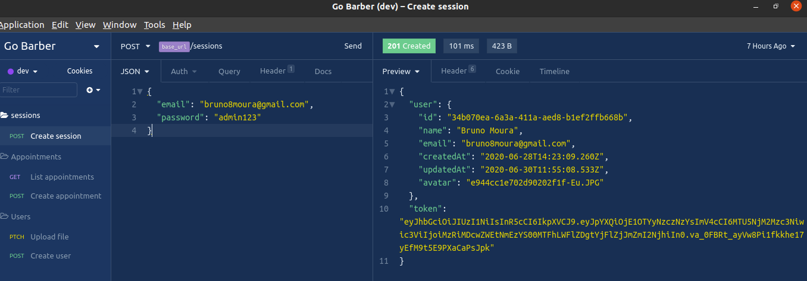
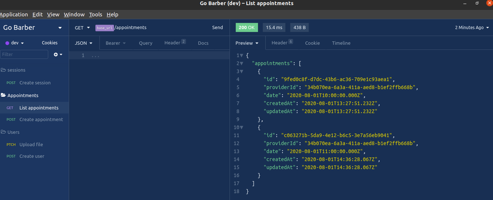
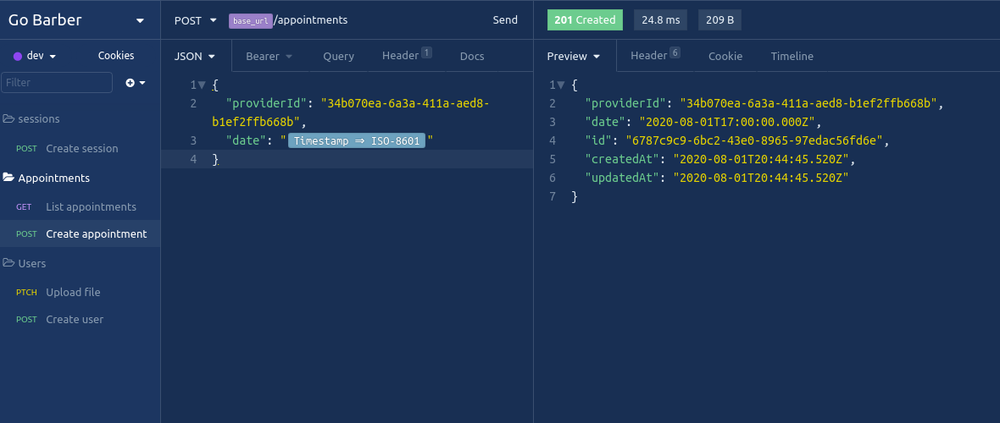
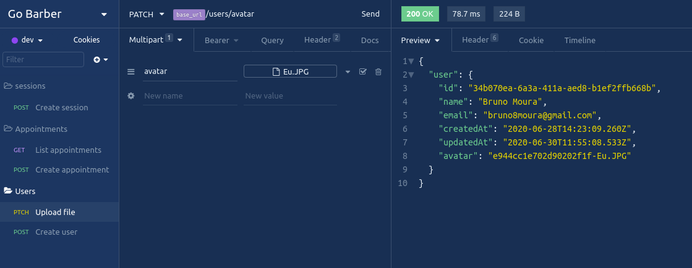
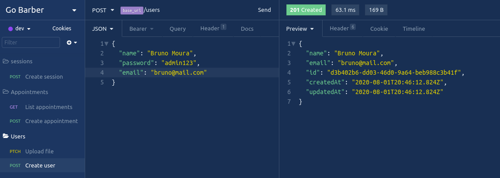

# Go Barber API

> ⚒👷 __UNDER CONSTRUCTION__ 👷⚒

## Description

In the world there are a bunch of barbers that is concerned about do their jobs as the best they can.

Create an easy way to the client book an appointment with his preferred barber or any other barber, is also a way to offer more comfort to the client when cutting his hair because a happy client is the certain that the job is being do the right way and business will be prosper.

This project is concerned about that. To provide a solution that facilitate the work of maintain the relation between clients and professionals in order to help clients when they needs a cut hair and professionals when they need to organize the clients and provide the service.

## Operations

See the documentation on
[Open API](https://app.swaggerhub.com/apis/bruno8moura/financialtransactions-api/1.0.0)

### Create session

### List all appointments

### Create an appointment

### Upload a file

### Create a user(provider)

## Why

That is the final project from the course Go Stack from [Rocket Seat](https://github.com/Rocketseat). And I'm adding this project for my personal portifolio, so if you could let me any feedback I'd appreciate so much. Any comment that can make me a better programmer will be help a lot!

And for sure, you can use this Project as you wish!

It's free!

## Contact info

My [LinkedIn](https://www.linkedin.com/in/bruno8moura/)

My email bruno8moura@gmail.com

## Getting started

### Prerequisites

NodeJS version: ^12

Postgres version: latest

## Running application

yarn start

## Build with

- [bcryptjs](https://www.npmjs.com/package/bcrypt) - Hash passwords.
- [date-fns](https://www.npmjs.com/package/date-fns) - It provides the most comprehensive, yet simple and consistent toolset for manipulating JavaScript dates in a browser & Node.js.
- [express](https://www.npmjs.com/package/express) - Creates an abstraction layer on NodeJS features, in order to facilitate the creation of web solutions.
- [express-async-errors](https://www.npmjs.com/package/express-async-errors) - Enable express to deal with async errors.
- [jsonwebtoken](https://www.npmjs.com/package/jsonwebtoken) - It helps to build and handle json web tokens.
- [multer](https://www.npmjs.com/package/multer) - Facilitates the workload when working with upload files.
- [pg](https://www.npmjs.com/package/pg) - Client for PostgreSQL database.
- [reflect-metadata](https://www.npmjs.com/package/reflect-metadata) - Enable the ability for the ECMScript to add metadata to classes through annotations just like Java and .net do.
- [typeorm](https://www.npmjs.com/package/typeorm) - An ORM to Nodejs.
- [uuidv4](https://www.npmjs.com/package/uuidv4) - A library for generating 128-bit alphanumeric identifiers.
